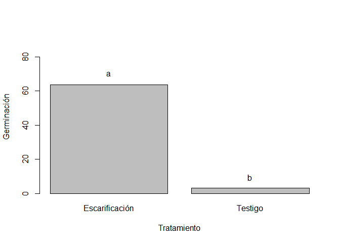
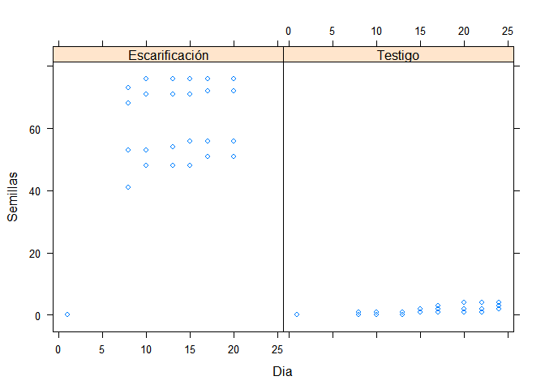
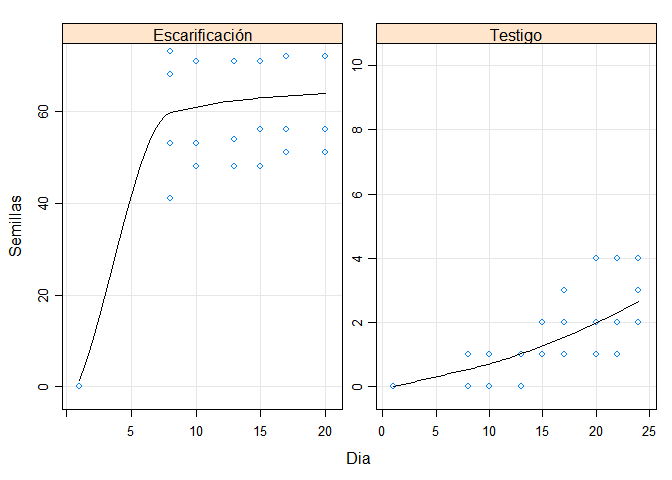
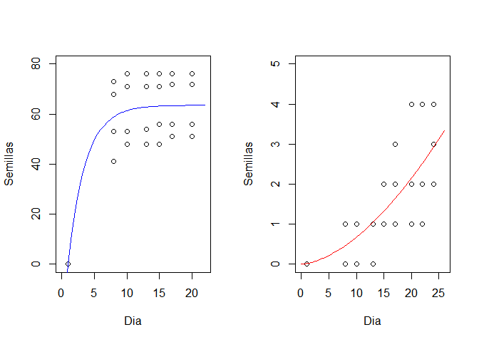
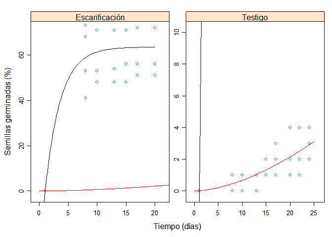

Ensayos de Germinación
================

#### Paquetes

``` r
require(readxl)
require(agricolae)
require(lattice)
require(pander)
require(kableExtra)
require(jtools)
library(sjPlot)
library(sjmisc)
library(sjlabelled)
```

``` r
datos=read_xlsx("Datos_germinacion.xlsx", sheet = "GermT")
kable(head(datos))
```

<table>

<thead>

<tr>

<th style="text-align:right;">

Semillas

</th>

<th style="text-align:left;">

Trat

</th>

<th style="text-align:right;">

Rep

</th>

<th style="text-align:right;">

Dia

</th>

</tr>

</thead>

<tbody>

<tr>

<td style="text-align:right;">

72

</td>

<td style="text-align:left;">

Escarificación

</td>

<td style="text-align:right;">

1

</td>

<td style="text-align:right;">

6

</td>

</tr>

<tr>

<td style="text-align:right;">

76

</td>

<td style="text-align:left;">

Escarificación

</td>

<td style="text-align:right;">

2

</td>

<td style="text-align:right;">

6

</td>

</tr>

<tr>

<td style="text-align:right;">

56

</td>

<td style="text-align:left;">

Escarificación

</td>

<td style="text-align:right;">

3

</td>

<td style="text-align:right;">

6

</td>

</tr>

<tr>

<td style="text-align:right;">

51

</td>

<td style="text-align:left;">

Escarificación

</td>

<td style="text-align:right;">

4

</td>

<td style="text-align:right;">

6

</td>

</tr>

<tr>

<td style="text-align:right;">

3

</td>

<td style="text-align:left;">

Testigo

</td>

<td style="text-align:right;">

1

</td>

<td style="text-align:right;">

8

</td>

</tr>

<tr>

<td style="text-align:right;">

4

</td>

<td style="text-align:left;">

Testigo

</td>

<td style="text-align:right;">

2

</td>

<td style="text-align:right;">

8

</td>

</tr>

</tbody>

</table>

``` r
mod=lm(Semillas~Trat, datos)
tab_model(mod)
```

<table style="border-collapse:collapse; border:none;">

<tr>

<th style="border-top: double; text-align:center; font-style:normal; font-weight:bold; padding:0.2cm;  text-align:left; ">

 

</th>

<th colspan="3" style="border-top: double; text-align:center; font-style:normal; font-weight:bold; padding:0.2cm; ">

Semillas

</th>

</tr>

<tr>

<td style=" text-align:center; border-bottom:1px solid; font-style:italic; font-weight:normal;  text-align:left; ">

Predictors

</td>

<td style=" text-align:center; border-bottom:1px solid; font-style:italic; font-weight:normal;  ">

Estimates

</td>

<td style=" text-align:center; border-bottom:1px solid; font-style:italic; font-weight:normal;  ">

CI

</td>

<td style=" text-align:center; border-bottom:1px solid; font-style:italic; font-weight:normal;  ">

p

</td>

</tr>

<tr>

<td style=" padding:0.2cm; text-align:left; vertical-align:top; text-align:left; ">

(Intercept)

</td>

<td style=" padding:0.2cm; text-align:left; vertical-align:top; text-align:center;  ">

63.75

</td>

<td style=" padding:0.2cm; text-align:left; vertical-align:top; text-align:center;  ">

53.24 – 74.26

</td>

<td style=" padding:0.2cm; text-align:left; vertical-align:top; text-align:center;  ">

<strong>\<0.001

</td>

</tr>

<tr>

<td style=" padding:0.2cm; text-align:left; vertical-align:top; text-align:left; ">

Trat \[Testigo\]

</td>

<td style=" padding:0.2cm; text-align:left; vertical-align:top; text-align:center;  ">

\-60.75

</td>

<td style=" padding:0.2cm; text-align:left; vertical-align:top; text-align:center;  ">

\-75.61 – -45.89

</td>

<td style=" padding:0.2cm; text-align:left; vertical-align:top; text-align:center;  ">

<strong>\<0.001

</td>

</tr>

<tr>

<td style=" padding:0.2cm; text-align:left; vertical-align:top; text-align:left; padding-top:0.1cm; padding-bottom:0.1cm; border-top:1px solid;">

Observations

</td>

<td style=" padding:0.2cm; text-align:left; vertical-align:top; padding-top:0.1cm; padding-bottom:0.1cm; text-align:left; border-top:1px solid;" colspan="3">

8

</td>

</tr>

<tr>

<td style=" padding:0.2cm; text-align:left; vertical-align:top; text-align:left; padding-top:0.1cm; padding-bottom:0.1cm;">

R<sup>2</sup> / R<sup>2</sup> adjusted

</td>

<td style=" padding:0.2cm; text-align:left; vertical-align:top; padding-top:0.1cm; padding-bottom:0.1cm; text-align:left;" colspan="3">

0.943 / 0.934

</td>

</tr>

</table>

``` r
pander(anova(mod))
```

|               | Df | Sum Sq | Mean Sq | F value |  Pr(\>F)  |
| :-----------: | :-: | :----: | :-----: | :-----: | :-------: |
|   **Trat**    | 1  |  7381  |  7381   |   100   | 5.788e-05 |
| **Residuals** | 6  | 442.7  |  73.79  |   NA    |    NA     |

Analysis of Variance Table

``` r
a1=aov(Semillas~Trat, datos)
```

``` r
(prueba=HSD.test(a1, "Trat"))
```

    ## $statistics
    ##    MSerror Df   Mean       CV      MSD
    ##   73.79167  6 33.375 25.73845 14.86302
    ## 
    ## $parameters
    ##    test name.t ntr StudentizedRange alpha
    ##   Tukey   Trat   2         3.460456  0.05
    ## 
    ## $means
    ##                Semillas        std r Min Max   Q25 Q50   Q75
    ## Escarificación    63.75 12.1209186 4  51  76 54.75  64 73.00
    ## Testigo            3.00  0.8164966 4   2   4  2.75   3  3.25
    ## 
    ## $comparison
    ## NULL
    ## 
    ## $groups
    ##                Semillas groups
    ## Escarificación    63.75      a
    ## Testigo            3.00      b
    ## 
    ## attr(,"class")
    ## [1] "group"

``` r
bar.group(prueba$groups,ylim=c(0,90),border="black", xlab="Tratamiento", ylab="Germinación")
```

<!-- -->

### Viabilidad

``` r
datos=read_xlsx("Datos_germinacion.xlsx", sheet = "Germinación")
kable(head(datos))
```

<table>

<thead>

<tr>

<th style="text-align:right;">

Semillas

</th>

<th style="text-align:left;">

Trat

</th>

<th style="text-align:right;">

Rep

</th>

<th style="text-align:right;">

Dia

</th>

<th style="text-align:left;">

Fecha

</th>

</tr>

</thead>

<tbody>

<tr>

<td style="text-align:right;">

0

</td>

<td style="text-align:left;">

Escarificación

</td>

<td style="text-align:right;">

1

</td>

<td style="text-align:right;">

1

</td>

<td style="text-align:left;">

2016-08-10

</td>

</tr>

<tr>

<td style="text-align:right;">

68

</td>

<td style="text-align:left;">

Escarificación

</td>

<td style="text-align:right;">

1

</td>

<td style="text-align:right;">

8

</td>

<td style="text-align:left;">

2016-08-17

</td>

</tr>

<tr>

<td style="text-align:right;">

71

</td>

<td style="text-align:left;">

Escarificación

</td>

<td style="text-align:right;">

1

</td>

<td style="text-align:right;">

10

</td>

<td style="text-align:left;">

2016-08-19

</td>

</tr>

<tr>

<td style="text-align:right;">

71

</td>

<td style="text-align:left;">

Escarificación

</td>

<td style="text-align:right;">

1

</td>

<td style="text-align:right;">

13

</td>

<td style="text-align:left;">

2016-08-22

</td>

</tr>

<tr>

<td style="text-align:right;">

71

</td>

<td style="text-align:left;">

Escarificación

</td>

<td style="text-align:right;">

1

</td>

<td style="text-align:right;">

15

</td>

<td style="text-align:left;">

2016-08-24

</td>

</tr>

<tr>

<td style="text-align:right;">

72

</td>

<td style="text-align:left;">

Escarificación

</td>

<td style="text-align:right;">

1

</td>

<td style="text-align:right;">

17

</td>

<td style="text-align:left;">

2016-08-26

</td>

</tr>

</tbody>

</table>

``` r
with(datos, xyplot(Semillas~Dia|Trat))
```

<!-- -->

``` r
xyplot(Semillas~Dia|Trat, data=datos, scales = list(relation = "free"),
  ylim = list(c(0, 70), c(0, 10)), 
  panel = function(x, y) {
    panel.xyplot(x, y, grid = TRUE,type = c("p", "smooth"),col.line = "black")
 })
```

<!-- -->

### Subset de la base de datos por tratamiento

``` r
datosE=subset(datos, Trat=="Escarificación")
datosT=subset(datos, Trat=="Testigo")
```

### Modelo no lineal del tratamiento

``` r
modn=nls(Semillas~a-b*exp(-c*Dia),start=list(a=1,b=75,c=0.5),data=datosE)
tab_model(modn)
```

    ## 'r2()' does not support models of class 'nls'.

<table style="border-collapse:collapse; border:none;">

<tr>

<th style="border-top: double; text-align:center; font-style:normal; font-weight:bold; padding:0.2cm;  text-align:left; ">

 

</th>

<th colspan="3" style="border-top: double; text-align:center; font-style:normal; font-weight:bold; padding:0.2cm; ">

Dependent variable

</th>

</tr>

<tr>

<td style=" text-align:center; border-bottom:1px solid; font-style:italic; font-weight:normal;  text-align:left; ">

Predictors

</td>

<td style=" text-align:center; border-bottom:1px solid; font-style:italic; font-weight:normal;  ">

Estimates

</td>

<td style=" text-align:center; border-bottom:1px solid; font-style:italic; font-weight:normal;  ">

CI

</td>

<td style=" text-align:center; border-bottom:1px solid; font-style:italic; font-weight:normal;  ">

p

</td>

</tr>

<tr>

<td style=" padding:0.2cm; text-align:left; vertical-align:top; text-align:left; ">

a

</td>

<td style=" padding:0.2cm; text-align:left; vertical-align:top; text-align:center;  ">

63.54

</td>

<td style=" padding:0.2cm; text-align:left; vertical-align:top; text-align:center;  ">

57.17 – 69.92

</td>

<td style=" padding:0.2cm; text-align:left; vertical-align:top; text-align:center;  ">

<strong>\<0.001

</td>

</tr>

<tr>

<td style=" padding:0.2cm; text-align:left; vertical-align:top; text-align:left; ">

b

</td>

<td style=" padding:0.2cm; text-align:left; vertical-align:top; text-align:center;  ">

92.47

</td>

<td style=" padding:0.2cm; text-align:left; vertical-align:top; text-align:center;  ">

56.96 – 127.97

</td>

<td style=" padding:0.2cm; text-align:left; vertical-align:top; text-align:center;  ">

<strong>\<0.001

</td>

</tr>

<tr>

<td style=" padding:0.2cm; text-align:left; vertical-align:top; text-align:left; ">

c

</td>

<td style=" padding:0.2cm; text-align:left; vertical-align:top; text-align:center;  ">

0.38

</td>

<td style=" padding:0.2cm; text-align:left; vertical-align:top; text-align:center;  ">

\-0.02 – 0.77

</td>

<td style=" padding:0.2cm; text-align:left; vertical-align:top; text-align:center;  ">

0.073

</td>

</tr>

<tr>

<td style=" padding:0.2cm; text-align:left; vertical-align:top; text-align:left; padding-top:0.1cm; padding-bottom:0.1cm; border-top:1px solid;">

Observations

</td>

<td style=" padding:0.2cm; text-align:left; vertical-align:top; padding-top:0.1cm; padding-bottom:0.1cm; text-align:left; border-top:1px solid;" colspan="3">

28

</td>

</tr>

</table>

``` r
co=coefficients(modn)
```

### Modelo no lineal del control o testigo

``` r
modt=lm(log(Semillas+0.1)~log(Dia), datosT)
tab_model(modt)
```

<table style="border-collapse:collapse; border:none;">

<tr>

<th style="border-top: double; text-align:center; font-style:normal; font-weight:bold; padding:0.2cm;  text-align:left; ">

 

</th>

<th colspan="3" style="border-top: double; text-align:center; font-style:normal; font-weight:bold; padding:0.2cm; ">

log(Semillas + 0.1)

</th>

</tr>

<tr>

<td style=" text-align:center; border-bottom:1px solid; font-style:italic; font-weight:normal;  text-align:left; ">

Predictors

</td>

<td style=" text-align:center; border-bottom:1px solid; font-style:italic; font-weight:normal;  ">

Estimates

</td>

<td style=" text-align:center; border-bottom:1px solid; font-style:italic; font-weight:normal;  ">

CI

</td>

<td style=" text-align:center; border-bottom:1px solid; font-style:italic; font-weight:normal;  ">

p

</td>

</tr>

<tr>

<td style=" padding:0.2cm; text-align:left; vertical-align:top; text-align:left; ">

(Intercept)

</td>

<td style=" padding:0.2cm; text-align:left; vertical-align:top; text-align:center;  ">

\-2.65

</td>

<td style=" padding:0.2cm; text-align:left; vertical-align:top; text-align:center;  ">

\-3.43 – -1.88

</td>

<td style=" padding:0.2cm; text-align:left; vertical-align:top; text-align:center;  ">

<strong>\<0.001

</td>

</tr>

<tr>

<td style=" padding:0.2cm; text-align:left; vertical-align:top; text-align:left; ">

Dia \[log\]

</td>

<td style=" padding:0.2cm; text-align:left; vertical-align:top; text-align:center;  ">

1.06

</td>

<td style=" padding:0.2cm; text-align:left; vertical-align:top; text-align:center;  ">

0.76 – 1.36

</td>

<td style=" padding:0.2cm; text-align:left; vertical-align:top; text-align:center;  ">

<strong>\<0.001

</td>

</tr>

<tr>

<td style=" padding:0.2cm; text-align:left; vertical-align:top; text-align:left; padding-top:0.1cm; padding-bottom:0.1cm; border-top:1px solid;">

Observations

</td>

<td style=" padding:0.2cm; text-align:left; vertical-align:top; padding-top:0.1cm; padding-bottom:0.1cm; text-align:left; border-top:1px solid;" colspan="3">

36

</td>

</tr>

<tr>

<td style=" padding:0.2cm; text-align:left; vertical-align:top; text-align:left; padding-top:0.1cm; padding-bottom:0.1cm;">

R<sup>2</sup> / R<sup>2</sup> adjusted

</td>

<td style=" padding:0.2cm; text-align:left; vertical-align:top; padding-top:0.1cm; padding-bottom:0.1cm; text-align:left;" colspan="3">

0.604 / 0.592

</td>

</tr>

</table>

``` r
modn2=nls(Semillas~a*(Dia^b),start=list(a=2,b=2),data=datosT)
tab_model(modn2)
```

    ## 'r2()' does not support models of class 'nls'.

<table style="border-collapse:collapse; border:none;">

<tr>

<th style="border-top: double; text-align:center; font-style:normal; font-weight:bold; padding:0.2cm;  text-align:left; ">

 

</th>

<th colspan="3" style="border-top: double; text-align:center; font-style:normal; font-weight:bold; padding:0.2cm; ">

Dependent variable

</th>

</tr>

<tr>

<td style=" text-align:center; border-bottom:1px solid; font-style:italic; font-weight:normal;  text-align:left; ">

Predictors

</td>

<td style=" text-align:center; border-bottom:1px solid; font-style:italic; font-weight:normal;  ">

Estimates

</td>

<td style=" text-align:center; border-bottom:1px solid; font-style:italic; font-weight:normal;  ">

CI

</td>

<td style=" text-align:center; border-bottom:1px solid; font-style:italic; font-weight:normal;  ">

p

</td>

</tr>

<tr>

<td style=" padding:0.2cm; text-align:left; vertical-align:top; text-align:left; ">

a

</td>

<td style=" padding:0.2cm; text-align:left; vertical-align:top; text-align:center;  ">

0.01

</td>

<td style=" padding:0.2cm; text-align:left; vertical-align:top; text-align:center;  ">

\-0.01 – 0.04

</td>

<td style=" padding:0.2cm; text-align:left; vertical-align:top; text-align:center;  ">

0.332

</td>

</tr>

<tr>

<td style=" padding:0.2cm; text-align:left; vertical-align:top; text-align:left; ">

b

</td>

<td style=" padding:0.2cm; text-align:left; vertical-align:top; text-align:center;  ">

1.67

</td>

<td style=" padding:0.2cm; text-align:left; vertical-align:top; text-align:center;  ">

1.01 – 2.33

</td>

<td style=" padding:0.2cm; text-align:left; vertical-align:top; text-align:center;  ">

<strong>\<0.001

</td>

</tr>

<tr>

<td style=" padding:0.2cm; text-align:left; vertical-align:top; text-align:left; padding-top:0.1cm; padding-bottom:0.1cm; border-top:1px solid;">

Observations

</td>

<td style=" padding:0.2cm; text-align:left; vertical-align:top; padding-top:0.1cm; padding-bottom:0.1cm; text-align:left; border-top:1px solid;" colspan="3">

36

</td>

</tr>

</table>

``` r
co2=coefficients(modn2)
```

### Figura

``` r
par(mfrow=c(1,2))
{
  with(datosE, plot(Dia, Semillas, xlim = c(0,22), ylim = c(0,80)))
  curve(co[1]-co[2]*exp(-co[3]*x),xlim = c(0,22), ylim = c(0,80), add=T, col="blue")
  with(datosT, plot(Dia, Semillas, xlim = c(0,26),ylim = c(0,5)))
  curve(co2[1]*(x^co2[2]),xlim = c(0,26),ylim = c(0,5), add=T, col="red")
}
```

<!-- -->

``` r
xyplot(Semillas~Dia|Trat, data=datos, scales = list(relation = "free"),
       ylim = list(c(0, 70), c(0, 10)),xlim = list(c(0, 21), c(0, 25.3)),
       xlab = "Tiempo (días)",ylab = "Semillas germinadas (%)",
       panel =function(x, y){
         panel.xyplot(x,y)
         panel.curve(co[1]-co[2]*exp(-co[3]*x),0,20, col.line="black", type="l", 
                     fun=(datos$Trat=="Escarificación"))
         panel.curve(co2[1]*(x^co2[2]),0,25, add=T,col.line="red")
         })
```

<!-- -->
